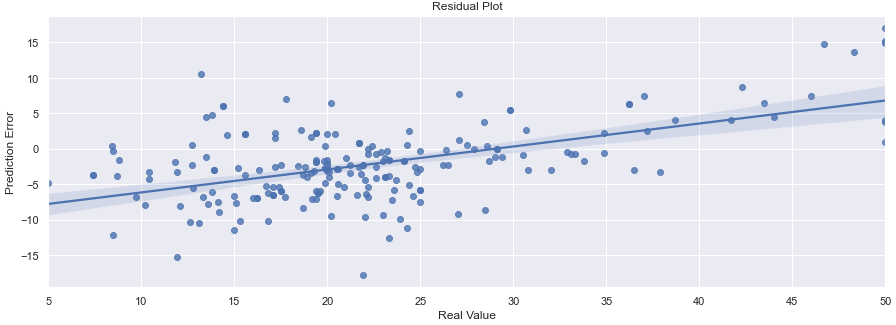
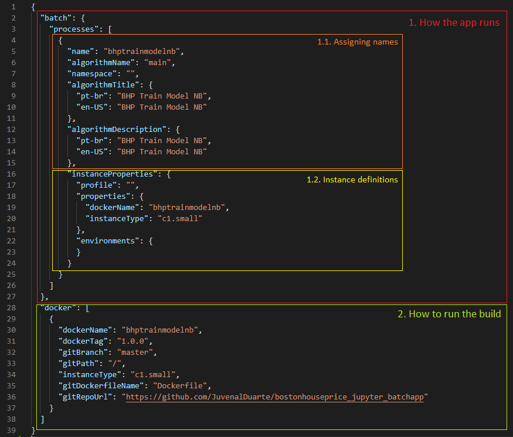
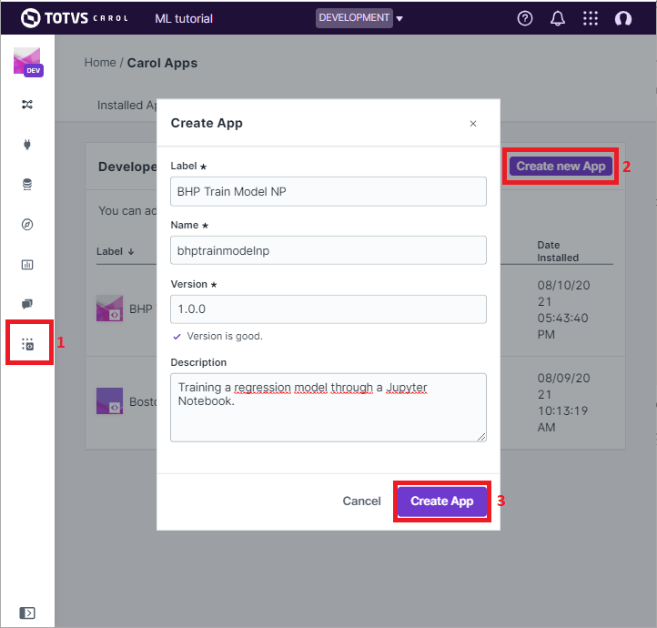
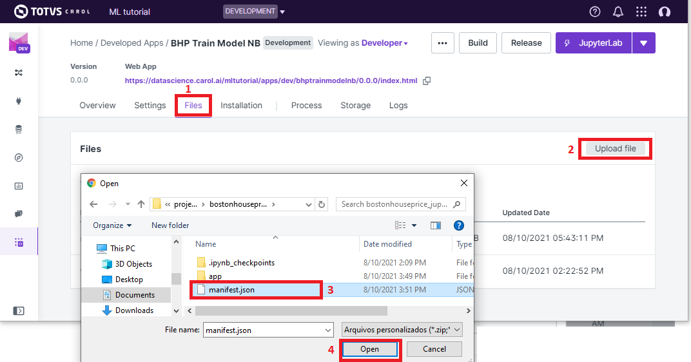
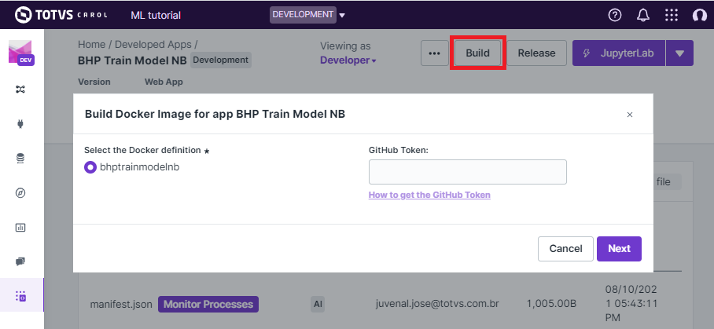
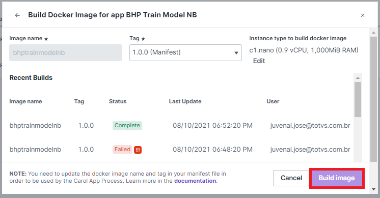
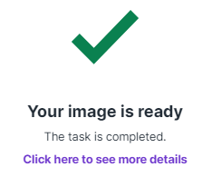
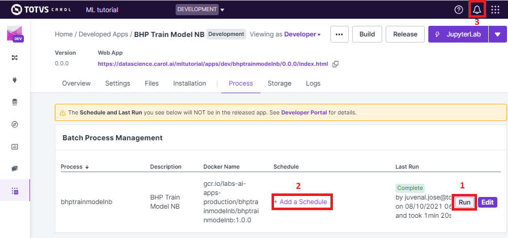

Training the model: a minimal batch app
=======================================

Now that we have our data ready, the next goal is to setup a process to
fetch the records, train and evaluate a regression model and deploy it
to perform predictions. In this chapter we will review how to create a
bare minimal app to do it using a Jupyter notebook, also covering how to
deploy the notebook in docker container to have an executable app.

Writing the notebook
--------------------

Similar to when we were loading data into Carol, to fetch data we have
also to start by making a connection to Carol feeding our credentials.
As our goal is to run the code inside a batch app we can skip the full
authentication and use the simplified version.

.. code:: python

    from pycarol import Carol, Staging, ApiKeyAuth

    ''' Complete authentication for tests running locally
    # =================== AUTHENTICATION ON CAROL ===================
    # Paste here your connection id and token
    connectors = {"mltutorial": '0f0883dXX2434057XXXf07ef86eXXXXX'}
    conn_tokens = {"mltutorial": '906XXb5ae5e7413c97fXXXX7d0XXXXXX'}
    # ===============================================================

    login = Carol(domain="mltutorial", 
                                app_name="bostonhouseprice", 
                                organization='datascience',
                                auth=ApiKeyAuth(conn_tokens["mltutorial"]),
                                connector_id=connectors["mltutorial"])
    '''

    #Simplified version for when running it inside an carol app
    login = Carol()

We then consume the data directly from staging with the code below. Data
will be returned from the ``fecth_parquet`` function as a dataframe. The
latest parameters available to the function are up to date in the code
`documentation <https://github.com/totvslabs/pyCarol/blob/master/pycarol/staging.py>`__.

.. code:: python

    # Buiding a staging object on top of the login credentials
    staging = Staging(login)

    # Defining the connector and staging where the data should be accessed
    conn = "boston_house_price"
    stag = "samples"

    # Specifying the columns to be used
    X_cols = ["CRIM", "ZN", "INDUS", "CHAS", "NOX", "RM", "AGE", "DIS", "RAD", "TAX", "PTRATIO", "B", "LSTAT"]
    y_col = ["target"]
    roi_cols = X_cols + y_col

    # Fecthing data from Carol
    data = staging.fetch_parquet(staging_name=stag,
                                                             connector_name=conn,
                                                             cds=True,
                                                             columns=roi_cols)

In this example we use a very simple training process just to ilustrate
the goal: split the data into a training and testing parts and fit a
Multilayer Perceptron (MLPRegressor), with default parameters, on the
training set.

.. code:: python

    from sklearn.model_selection import train_test_split
    from sklearn.neural_network import MLPRegressor

    # Splitting the dataset: 80% for training, 20% for test
    X_train, X_test, y_train, y_test = train_test_split(data[X_cols],
                                                        data[y_col], 
                                                        test_size=0.20, 
                                                        random_state=1,
                                                                                                            shuffle=True)

    # Fitting a standard hyperparameters MLP regressor
    mlp_model = MLPRegressor(random_state=1, max_iter=500)
    mlp_model.fit(X_train, 
                                y_train["target"].values)

We then evaluate our model against the test set using the classical
regression evaluation metrics **MSE**, **MAE** and **RMSE**.

.. code:: python

    import numpy as np

    # Calculating the error (residuals)
    y_real = list(y_test["target"].values)
    residual = list(y_test["target"].values) - y_pred

    # Calculating summary metrics
    mse_f = np.mean(residual**2)
    mae_f = np.mean(abs(residual))
    rmse_f = np.sqrt(mse_f)

    # Printing the results
    display(f"Mean Squared Error (MSE): {mse_f}.")
    display(f"Mean Absolute Error (MAE): {mae_f}.")
    display(f"Root Mean Squared Error (RMSE): {rmse_f}.")

    # Results
    '''
    Mean Squared Error (MSE): 32.83513021826763.
    Mean Absolute Error (MAE): 4.538316218898927.
    Root Mean Squared Error (RMSE): 5.7301946056192214.
    '''

We can also evaluate our regression in further details by plotting a
residual scatter plot. The residual plot allows us to check the error
distribution along different values of ``y``.

.. code:: python

    import pandas as pd
    import seaborn as sns; sns.set_theme(color_codes=True)
    from matplotlib import pyplot as plt

    # Organize the real values and the predictions on a dataframe
    res_df = pd.DataFrame({"y":y_real, "res":residual})

    # Make the plot on a 20 by 8 panel
    plt.figure(figsize=(20,8))
    ax = sns.regplot(x="y", y="res", data=res_df)

    # Add legends
    ax.set_title('Residual Plot')
    tmp = ax.set(xlabel='Real Value', ylabel='Prediction Error')

The resulting plot is presented on *figure 19*.

Figure 19: The residual plot achieved by the MLP model we trained

If from the evaluation we conclude the model is good enough to our
needs, we can deploy it by saving it to the local storage. The code is
given below.

.. code:: python

    # Saving the model to the storage.
    stg = Storage(login)
    stg.save("bhp_mlp_regressor", mlp_model, format='pickle')

With the code snippet above you are publishing the model as pickle file
to the storage on the same app you are running. If you are interested in
deploying your model somewhere else (an online app, for example), you
can simply change the login variable and point it to the correct app.

.. code:: python

    # Authenticating on Carol with default parameters from the enviornment
    login = Carol()

    # Pointing to a different application under the same environment
    login.app_name = 'my_online_app'

    # Pointing to a different application in a different environment and org level
    login.switch_environment(org_name="another_org_level", 
                                                     env_name="another_environment", 
                                                     app_name='my_online_app')

In some situations you may be interested in publishing the model to an
app in another environment, perhaps even in a different organization
level. In that case you can use the ``switch_environment`` method. One
of the advantages is that access control will be managed automatically:
if the user running the process has access granted to the target
environment the process will run smothly, otherwise the batch will fail
with denied authentication.

The whole code is available at `this <https://github.com/totvslabs/pyCarol/tree/master/tutorial/chapters/ch4_basic_batchapp>`__ github repo.

Files for the batch app
-----------------------

Apart from the code, there are a couple of other files which we need to
revise to be able to build our app inside Carol, they are:

-  *requirements.txt*: This file is nothing but a list of modules used
   in our application.
-  *manifest.json*: Brings definitions on how the app needs to be built
   and how it will run.
-  *Dockerfile*: Sets the docker commands necessary to build the app.

Starting with *requirements.txt*, we want to fill it with the python
modules on the list below. During the build docker will asure we have
these libs installed on the environment, you can also enforce the
lib version as in ``pandas==1.2.5``. This is a way of fixing problems
with new releases and grant the app behaves the same way no matter which
environment it is deployed.

.. code:: python

    pycarol[complete]
    sklearn
    runipy
    seaborn

In the *manifest.json* there are two main sections, the first defining
how the app runs (*1*) and the second defining how it is built (*2*).
For the namings on (*1.1*) the only caution is that ``algorithmTitle``
and ``algorithmDescription``\ fields accept any string, while ``name``
allows only lowercased strings without spaces or special characters.

   ../../imgs/tutorial_ch4\_fig2.png
Figure 19: Main sections on the manifest.json file

On the ``instanceProperties`` section (*1.2*) we define on which type of
cloud instance and which parameters to use when running the app. The
first important field is ``property/dockerImage``, which should follow
the following standard:

.. code:: json

    "dockerImage": "yourcarolappname/yourbatchprocessesname:yourappversion"

Next you define the size of the machine you want to use when executing
your code on ``property/instanceType``. A complete list of instance
types available are covered in the official documentation, at 
`this <https://docs.carol.ai/docs/carol-app-instance-type>`__ link.

On the ``docker`` section (*2*) we set the necessary configurations
needed to build our app. The fields are:

-  ``dockerName``: The name of the docker container where the code is
   going to run. For convention we set it as the same name in
   ``batch/process/name``, lowercased and without spaces or special
   characters.
-  ``dockerTag``: Used for version control.
-  ``gitRepoUrl``: To build the app all the files need to be placed at a
   version control repository. The link to the repository must be
   provided in this field.
-  ``gitBranch``: The version control branch where the files resides.
-  ``gitPath``: Use ``/`` when the Dockerfile is on the root path or the
   corresponding path otherwise.
-  ``instanceType``: The cloud machine used to build the code.
-  ``gitDockerfileName``: The docker file name on your repository.

The final mandatory file is the *Dockerfile* (or any other name
depending on the definition on ``gitDockerfileName``)\ *.* In this file
we have a sequence of commands necessary to make sure the environment
has the right files, the right base software and the right lib versions
to run the code without conflicts. A full description of how to
construct the file is given on the official docker manual, at
`this <https://docs.docker.com/engine/reference/builder/>`__ link.

For our minimal batch app we will use the *Dockerfile* as below:

.. code:: docker

    # Setting the base cloud image to be enhanced
    FROM totvslabs/pycarol:2.40.0

    # Copying the requirement file and installing the dependencies
    RUN mkdir /app
    WORKDIR /app
    ADD requirements.txt /app/
    RUN pip install -r requirements.txt

    # Configuring the entry point for the app
    ADD . /app
    CMD ["runipy", "bhp_trainmodel.ipynb"]

Together with the notebook, the final setup on git should be as in:

    https://github.com/totvslabs/pyCarol/tree/master/tutorial/chapters/ch4_basic_batchapp.

Deploying to Carol
------------------

The only remaining step now is to deploy our app in Carol, so that we
can run it whenever we want with a single click. We start by creating a
new app through the UI, as in *figure 20*.

    **Note**: pay attention at this point and make sure the ``name`` you
    assign to your app corresponds to the same used on the
    ``manifest.json`` file, on ``property/dockerImage``.

Figure 20: Creating an App on Carol to deploy our code.

Now select the ``File`` tab, click on ``Upload File`` button, select the
``manifest.json`` file we've created previously and then click on
``Open``\ (*figure 21*).

Figure 21: Loading the manifest file to the platform.

The ``manifest.json`` already puts together everything we need for the
build. The files and the code will be retrieved from the version control
repository pointed in ``gitRepoUrl``.

To run the build click on the ``Build`` button, the next screen will ask
you for your github token (*figure 22*). The github token allows Carol
the fetch the files from your github account, for the specified branch.
You can follow the steps on the 
`official documentation <https://docs.github.com/en/github/authenticating-to-github/keeping-your-account-and-data-secure/creating-a-personal-access-token>`__
to generate a new github token.

Figure 22: Build: providing the github token

On the next screen just make sure your app version and instance type for
the build are correct, then click on ``Build Image``.

Figure 23: Revising and running the buid.

The process for building the app usually takes from 5 to 15 minutes to
perform the setup. If everything goes well you will see the screen on
*figure 24*.

Figure 24: Image successfully built

Running the app
---------------

On the ``Process`` tab on your app's panel, there are two ways of
setting up a execution for your app, as pointed on *figure 25*: (*1*)
Run it manually by clicking on the ``Run`` button; (*2*) Schedule single
or recurrent executions through the ``Add a Schedule`` option.

Figure 25: Running your app

Once started a pop-up screen will open informing you on whether the
process is still running, concluded or have failed. You can also check
detailed info about the process and other tasks on the small bell icon
on the top right of the screen (check (*3*) on *figure 25*).

Finally, the ``Logs`` tab on the app's panel will print the output of
your code. Remember to mantain your app's verbosity at a reasonable
level.

Troubleshooting
---------------

Below are are presented some well known problems when developing/
deploying Carol Apps:

-  **``instanceType`` is not big enough**: Correctly sizing resources is
   essential to control costs when running apps. On the other hand, if
   the process is memory or CPU intensive, your process may run out of
   resources either on build or on execution. For the build it is common
   to run out of memory if dependencies include heavy packages, such as
   pytorch, requiring at least ``c1.small`` (5Gb RAM).
-  **Wrong ``gitRepoUrl``, ``gitBranch`` or ``gitPath``**: When handling
   big repositories you can easily get confused and end up building
   the wrong version of your code. Another subtle problem is that recent
   github repositories use ``master`` to refer to the head branch, while
   old ones refer as ``main``.
-  **The docker container doesn't replicates all the environment files /
   libs as on local tests**: We often run on the situation where tests
   work fine on the local machine, but fails when running it remotely.
   Docker containers aim to help with such problems, but to do so the
   build process must be well defined. If you are reading any file from
   your local disk, make sure this file is also deployed together on
   your build. If you are using a lib with constant updates, make sure
   to explicitly set the lib version on your requirements to the same
   version on your local machine.
-  **Code issues**: Code issues rarely impacts the building process, but
   they usually arises when running the app. Several type of issues may
   arise when running the process, a good practice is to debug
   extensively the code locally before deploying, but even after that
   you find errors when running it on Carol you can debug the errors
   using the ``Logs`` tab on your app's panel.
