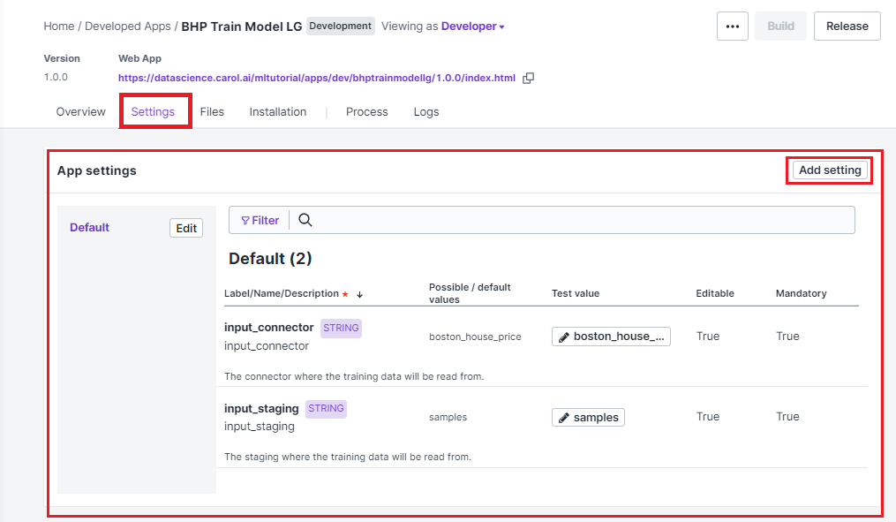

Training the model: task orchestration with Luigi
=================================================

In the previous chapter 
we've seen how to create a minimal app to run all the steps necessary to
train our model. It turns out that, even though this approach is simple
and fast, it may not be appropriate for production requirements, which
may include much more complex task pipelines.

If we look back to our previous code we can identify at least three
different steps:

1. **Data ingestion**: We need to download the records from Carol to
   train/ validate the model.
2. **Model training**: We use the data to train the model.
3. **Model evaluation**: We generate basic metrics for our new model
   to check its performance.

    Notice that these tasks are already ordered in terms of dependency,
    given that **Model evaluation** depends both on the **Data
    ingestion** and **Model training**.

Once these tasks are split and chained, it becomes easier to debug
which parts of the process went well, where it crashed and which steps
are still pending. The main goal of the Luigi package (see docs
`here <https://luigi.readthedocs.io/en/stable/>`__) is to orchestrate
these tasks and make sure concluded steps from previous executions can
be reused whenever it is possible.

This behaviour is specially usefull when dealing with long running
tasks. Imagine, for example, that your data ingestion comprises loading
and transforming 50M records, suppose this task takes one hour to
process. Suppose also that training your model takes another five hours
of intense GPU consumption. Now picture the bash crashing on the model
evaluation step. If all parameters remain the same and you are using
Luigi, only the final part, model evaluation, will need to be
reprocessed, otherwise another six hours will be spent to reprocess the
exact same results.

The way Luigi controls reexecutions is by the following rules:

-  Whenever a process concludes, all the relevant results are stored to
   the storage on the app.
-  If a previous execution is found with the exact same parameters just
   reuse its outputs.

Now let's see how can we transform the example to take advantage of
Luigi orchestration.

Adjusting the code
------------------

Let's start by revising, organizing and adjusting our code. A good
practice to organize code on Luigi-based apps is to have the following
directories:

.. code:: bash

    /app/
    /app/flow/
    /app/functions/

The ``app`` folder is were we store all of our code files. Inside this
directory we have ``flow`` and ``functions``, where we place the tasks
(Luigi classes) and business logic respectively. In our case, as the
logic is fairly simple, we can implement it directly on the flow source
files.

    The name of these folders are free of choice, but this is the naming
    convention along TOTVS Labs apps.

Organizing the code we should have something like the structure
presented below. Apart from the main tasks' source code we need to have
the ``__init__.py`` files, to make sure code from
different files can be shared, also we add the ``commons.py`` to handle
all the App parameters and constants. We also added another task,
``deploy_model.py``, to handle model deployment.

.. code:: bash

    /app/
    /app/flow/
    /app/flow/__init__.py
    /app/flow/commons.py
    /app/flow/ingestion.py
    /app/flow/train_model.py
    /app/flow/evaluate_model.py
    /app/flow/deploy_model.py
    /app/functions/
    /app/functions/__init__.py

The full source code is available at
`this <https://github.com/totvslabs/pyCarol/tree/master/tutorial/chapters/ch5_enhanced_batchapp>`__
github link, but a few snippets are worth being explained further. We
will have a look at them at the following chapters.

Accessing App Settings
----------------------

We can directly access the settings of our app (set on the UI) through
the lines below. The example uses the ``pycarol.apps.Apps`` class to get
the ``_settings`` dict, then it reads the settings values with passing
as keys the same names configured on the UI.

.. code:: python

    # App parameters: reading from Settings
    #-----------------------------------------
    from pycarol.apps import Apps
    _settings = Apps(Carol()).get_settings()
    now_str = datetime.now().isoformat()
    connector_name = _settings.get('input_connector')
    staging_name = _settings.get('input_staging')

    On our previous app we set input staging and connector hard coded on
    the source code, this time we use it parameterized through the app
    settings.

Figure 1 shows how the settings are configured on the user interface.
Notice that the setting name must match exactly the key used on the
code.

   
Figure 1: App settings configuration

Creating a Luigi task
---------------------

To exemplify how a task source file is composed on Luigi we will look
closer to the Model Training step. The full source code is shown below:

.. code:: python

    import luigi
    import logging
    from pycarol.pipeline import inherit_list
    from pycarol.pipeline.targets import PickleTarget
    from pycarol import Storage
    from sklearn.model_selection import train_test_split
    from sklearn.neural_network import MLPRegressor

    # Importing the task with basic configurations
    # in place to use as baseline. This task will
    # be extend to perform the business logic we
    # want.
    #-----------------------------------------
    from .commons import Task

    # This task depends on the ingestion outputs.
    # We import the class here to add as a depen
    # dency.
    #-----------------------------------------
    from . import ingestion

    logger = logging.getLogger(__name__)
    luigi.auto_namespace(scope=__name__)

    # Adding the dependencies. This tasks will
    # be blocked until the Ingestion outputs 
    # are available.
    #-----------------------------------------
    @inherit_list(
        ingestion.IngestRecords
    )
    class TrainModel(Task):

        # Recovering parameters from settings
        #-----------------------------------------
        model_l2regularization = luigi.Parameter()
        model_epochs = luigi.Parameter()

        # Selecting how the output will be persis-
        # ted after the processing.
        #-----------------------------------------
        target_type = PickleTarget

        def easy_run(self, inputs):

            # Retrieving outputs from previous task
            #-----------------------------------------
            data = inputs[0]

            logger.info(f'Spliting train/ test portions of the data.')
            X_cols = ["CRIM", "ZN", "INDUS", "CHAS", "NOX", "RM", "AGE", "DIS", "RAD", "TAX", "PTRATIO", "B", "LSTAT"] 
            y_col = ["target"]
            X_train, X_test, y_train, y_test = train_test_split(data[X_cols],
                                                                data[y_col], 
                                                                test_size=0.20, 
                                                                random_state=1)

            logger.info(f'Training a MLP with {X_train.shape[0]} samples.')
            mlp_model = MLPRegressor(random_state=1, 
                                     alpha=self.model_l2regularization,
                                     max_iter=self.model_epochs).fit(X_train, y_train["target"].values)

            logger.info(f'Making predictions for {X_test.shape[0]} records on test set.')
            y_pred_train = mlp_model.predict(y_train)
            y_pred_test = mlp_model.predict(X_test)

            logger.info(f'Saving model to storage.')
            stg = Storage(login)
            stg.save("bhp_mlp_regressor", mlp_model, format='pickle')

            # Returning the model and real/predictions 
            # pairs for train and test (used on validation)
            #-----------------------------------------
            return (mlp_model, (y_train, y_pred_train), (y_test, y_pred_test))

A couple of things to pay special attention at the code:

-  The annotation ``@inherit_list`` is used to tell Luigi which tasks
   must be completed before starting the current one.
-  You can choose any name for the task, but it must inherit from
   ``pycarol.pipeline.Task``.
-  The actual code to be executed (business logic) is implemented on the
   ``easy_run`` function. In this function you can access outputs from
   the previous tasks defined on ``@inherit_list`` through the parameter
   ``inputs``, provided as a list. Whatever is returned by this function
   will be made available for the following tasks as well. Notice that
   in the example we use ``PickleTarget``, which works for most of the
   situations, but if the output variables are not serializable, or have
   more efficient ways of doing it, have a look at the 
   `suported target types <https://luigi.readthedocs.io/en/stable/workflows.html>`__ 
   provided by Luigi.
-  If parameters are defined on the ``commons.py`` source we can load
   them through ``luigi.Parameter()`` command (different data formats
   are available, refer to the
   `manual <https://luigi.readthedocs.io/en/stable/parameters.html#:~:text=only%20inside%20task.-,Parameter%20types,-In%20the%20examples>`__
   for more information). Notice that task will be triggered only if
   either these parameters have values changed or the outputs from
   previous tasks differ from previous executions.

    If, for any reason, you need the task to be reexecuted forcibly, no
    matter if all inputs remain the same, you can do it by importing the
    ``datetime`` parameter. That will cause the app to replicate files
    on the storage, which will never be cleaned. For this reason this
    approach is only recommended if the task doesn't generates outputs
    or if they will be managed by third part apps.

Other files for a Luigi batch app
---------------------------------

Once our code is ready, we just need to revise a couple of auxiliar
files to make sure the app is built and executed as expected. The
*requirements.txt* and *manifest.json* will be defined just like we did
on the previous app, just revise them to make sure dependencies are
updated.

On Luigi, even though we have our workload divided in tasks, we must add
an entry point for the batch app, this entry point is the ``run.py``
source. The full code is shown below. This code shouldn't change much
between apps, the only attention point is to the ``get_tasks`` function,
which should include only the target tasks, since all the chained tasks
will executed as dependencies (such as ingestion and model training).

.. code:: python

    import sys
    from time import time
    from app.flow import commons, deploy_model
    from dotenv import load_dotenv
    load_dotenv('.env', override=True)

    # Defining the list of all target tasks. 
    # Intermediate tasks will be processed as
    # dependencies, so they don't need to be 
    # mentioned here.
    #-----------------------------------------
    def get_tasks():
        task_list = [deploy_model.DeployModel(**commons.params)]

        return task_list

    # Make sure the task are executed only in 
    # the main thread.
    #-----------------------------------------
    if __name__ == '__main__':

        task_list = get_tasks()

        t0 = time()

        # Building and dispatching each task listed.
        #-----------------------------------------
        for task in task_list:
            commons.logger.debug(f'Starting task: "{task}')
            exec_status = commons.luigi.build([task], local_scheduler=True, workers=1,
                                              scheduler_port=8880,
                                              detailed_summary=True)

            commons.logger.debug(f'Finished {task}, Elapsed time: {time() - t0}')
            if exec_status.status.name == 'SUCCESS_WITH_RETRY' or exec_status.status.name == 'SUCCESS':
                continue
            else:
                commons.logger.error(f'Error: Elapsed time: {time() - t0}')
                sys.exit(1)

        commons.logger.info(f'Elapsed time: {time() - t0}')

The entry point should also be adjusted on the ``Dockerfile`` as well as
follows:

.. code:: python

    ...
    CMD ["python", "run.py"]

Finally, we just need to adjust the ``logging.cfg`` (sample here) and
``luigi.cfg`` files, being the first for log standards and the second to
define how the orchestration will behave. All the available
configuration options on Luigi are listed on `this
section <https://luigi.readthedocs.io/en/stable/configuration.html#:~:text=option%0Amysection().intoption-,Configurable%20options,-Luigi%20comes%20with>`__
of the manual.

The final directory structure should be:

.. code:: bash

    /app/
    /app/flow/
    /app/flow/__init__.py
    /app/flow/commons.py
    /app/flow/ingestion.py
    /app/flow/train_model.py
    /app/flow/evaluate_model.py
    /app/flow/deploy_model.py
    /app/functions/
    /app/functions/__init__.py
    Dockerfile
    logging.cfg
    luigi.cfg
    manifest.json
    requirements.txt
    run.py

The deploy follows the same steps described on the minimal batch app.
The final project is available on 
`github <https://github.com/totvslabs/pyCarol/tree/master/tutorial/chapters/ch5_enhanced_batchapp>`__.
