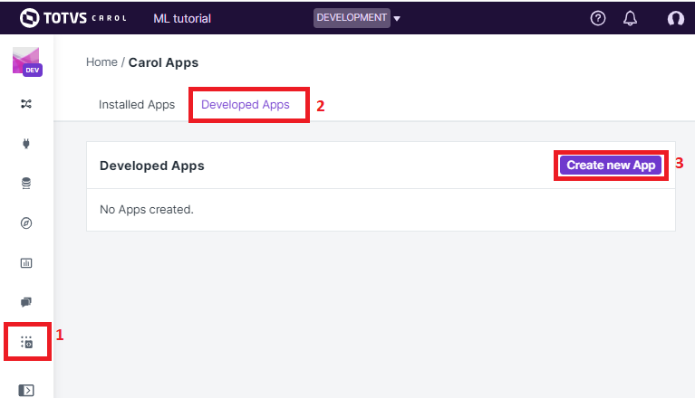

Introduction
============

Carol environment: how to get started
-------------------------------------

On your first access to the Carol environment you will be presented to
the screen on Figure 1. On the picture there are several elements to be
noticed.

-  **A**: The URL is composed by the ``organization level id`` followed
   by ``.carol.ai``, then appended with the ``environment id``. The
   working environment will also the be shown on **B**.
-  **C**: The left panel shows the different components available on
   Carol. On this tutorial we will be be focusing mostly on
   ``Connectors``, ``Data Models`` and ``Carol Apps``.
-  **D**: On this pop-up you have the user and environement admin
   configurations. Through this drop down you can, for example, revise
   access tokens defined on the environment. This topic is covered later
   on this document.

Figure 1: Welcome screen on Carol

Further material on each of the individual components can be found on on
the official documentation: https://docs.carol.ai/docs.

Creating a connector to store your data
---------------------------------------

Even though it is not mandatory, it is a good practice to load your
dataset into the Carol Platform. Once on carol, the data can be easilly
integrated, transformed, validated and consumed by your Carol Apps.

Carol organizes its datasets in **connectors**. Connectors can be viewed
as a parallel for databases on convetional SGBDs, or as sheets on
spreadsheets softwares. Inside the connectors you can store data in one
or more **stagings**, where the actual tabular data will reside. These
components are further described on https://docs.carol.ai/docs.

To create a new connector click on the ``Connectors`` icon on the left
panel, then on ``All`` option, and then on the ``Add a Connector``
button (see figure 2).

Figure 2: Openning the create connector wizard.

The platform will conduct you through an wizard process, where you first
need to set the name of your project (figure 3).

Figure 3: Choosing a name for your project

The following step is to choose which technology will be used to fetch
your data from the source systems. There are several connector types
available for your choice, and even new ones can be configured depending
on the project. For this simple exercise we will manage the data
ingestion through external code, using the PyCarol python library,
therefore we can proceed by selecting the ``Custom`` connector type
(figure 4).

Figure 4: All connector types available on Carol platform to the moment.

The following two steps you need to set a label for your connector
(figure 5) and then confirm its creation (figure 6). It is a good
practice to avoid spaces when setting the connector name, which can be
accomplished by using *snake cased* (ex.: Bostom\_House\_Prices) or
*pascal cased* (ex.: BostomHousePrices) names.

Figure 5: Naming your connector

.. figure:: ../../imgs/tutorial_ch1_fig6.png
   :alt: ../../imgs/tutorial_ch1\_fig6.png
Figure 6: Confirming the creation of your new connector

Now your connector has been created and is ready to receive data. If
your data is complex enough, it may be worth spliting on different
connectors or stagings and joined together later through a data model.
In general tables from the same data source should be stored under the
same connector but in different stagings. When handling multiple data
sources different connectors should be used.

Generating an access token
--------------------------

For most of the steps on the tutorial we will be accessing the Carol
environment not through the GUI, but through scripts and code. In order
to be able to do so we first need to create an access token to the
environment. The access token sets the security level to asure only
authorized applications can interact with your environment and data.

On the user / environment configurations drop down, on the top right,
click on ``Environment Admin``. Now select the ``Tokens`` sheet and the
click on the ``Create token`` button. The steps are ilustrated on figure
7.

Figure 7: Sequence of steps to create a new token.

It is enough for you to select a connector and give a brief description
of the purpose for the access token. After clicking on Generate you will
be presented with the ``connector id`` and the access ``token`` strings
(figure 8). Take note of these values, the ``Connector Id`` can still be
viewed after you click on ``Done``, but the access ``Token`` won't be
available anymore.

Figure 8: Revising the generated token

If for any reason the access ``Token`` is lost, it is recommended to
revoke and create a new one in sequence.

Creating your first Carol App
-----------------------------

Carol Apps gives you the flexibility to implement different types of
applications to interact with your data, providing useful solutions for
your business. When we create an app inside Carol, the platform will
create all the necessary backend in order to be able to run your code.

To create an app, it doesn't matter if it is an online, batch or web app
for now, go to the Carol Apps icon on the left panel, then select
``Developed Apps`` and then click on ``Create a new App`` (see figure
9). You might not have the ``Developed Apps`` option available yet, in
that case contact you administrator and ask for the permission.

Figure 9: Creating an Carol App

After clicking on ``Create a new App`` you will be prompted with a
couple of infos to be filled:

-  *Label*: The label which will be presented on the GUI.
-  *Name*: The internal identifier used along the environment.
-  *Version*: The release version for your app.
-  *Description*: A brief description of the purpose of the given App.

After filling the required info you can go on and click on the
``Create App`` button. The page on *figure 10* will be presented with
you App admin information. On this page you can start by revising the
platform URL for your app and its version (*3*).

Figure 10: App admin web page

On the tabs below (*2*) you have panels with information about your app.
On the ``Overview`` tab you can view a summary of your environment, the
``Settings`` tab allows you to create parameters which can be read
during execution. In ``Files`` is where the build files are placed (more
details are covered later on the doc). The ``Installation`` tab helps
you deploy your app to other environments.

The last two tabs, ``Process`` and ``Logs``, are the panels where you
can control the execution of your App and check for debug information.
On ``Process`` your can either make a single execution (or schedule
recurrent ones) for online batches or you can start a server process for
online and web Apps. The logs are always presented time ordered on the
``Logs`` panel.

The section (*1*) on *figure 10* is used for building and releasing your
code. This topic is covered in details on
https://docs.carol.ai/docs/carol-app-dev, but essentially the type of
App you are developing will be dependent on how you structure the files
on the ``Files`` panel on section (*2*), After building, Carol will
automatically reorganize your admin screen according to the App type:
*batch*, *online* or *web*.

An alternative for writing plain code and building an app is to use the
``JupyterLab`` functionality. When you click on this button, an instance
Jupyter Lab will be started on Carol's cloud and you can run your code
on a remote machine, The notebooks can be used to simplify prototypes
and tests bypassing authentication details, since it is already running
on top of your app configurations, and building steps.