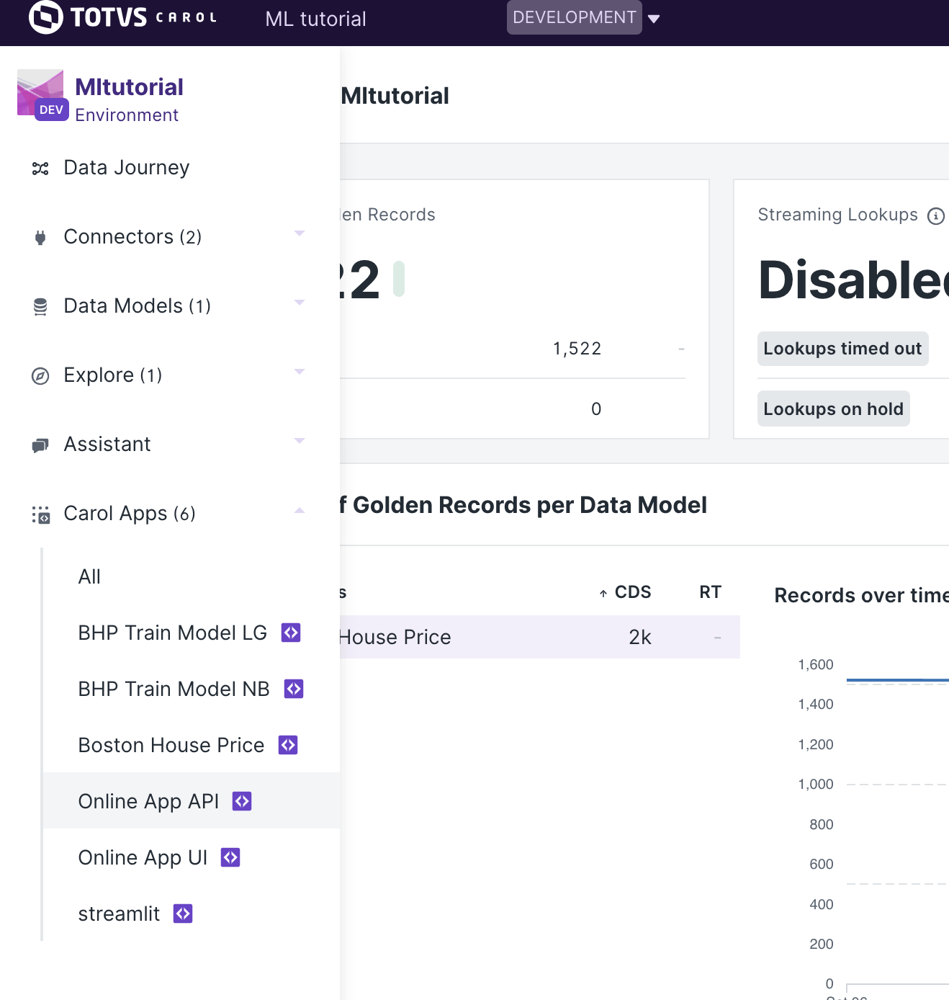
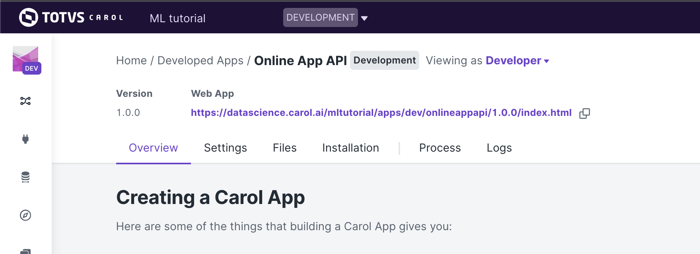
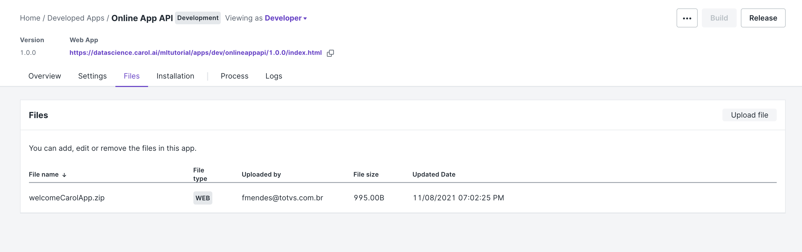
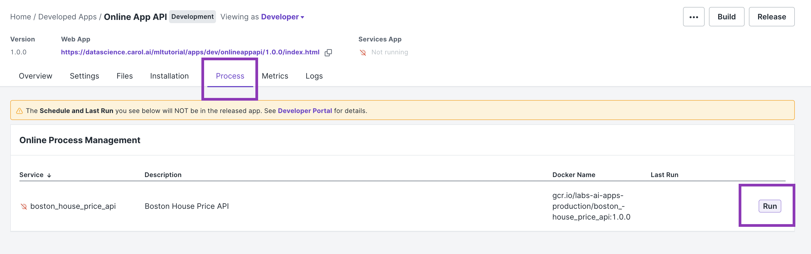

Online app: Serving requests through a REST API
===============================================

On the previous chapters we have seen how to work with batch apps, which
are used to perform punctual tasks, either by manual or scheduled
execution. Carol has a second concept of applications: online apps.

An online app is a server that runs on top of Carol. By server we mean
it keeps running indefinitely until the process is manually stoped,
handling requests from different applications / users and returning the
processed results according to well established protocols. In this
tutorial we will be covering the creation of an online app API for the
BHP problem, to produce house price predictions given user provided
house characteristics. The predictions are built through the model
trained in the batch app chapter.

Our online app is created using the
`Flask <https://flask.palletsprojects.com/en/2.0.x/>`__ library to help
on handling the different REST routes, and
`Marshmallow <https://marshmallow.readthedocs.io/en/stable/quickstart.html#>`__
framework to help with object serialization. The `gunicorn
server <https://gunicorn.org/>`__ acts as a container for the service,
helping on the control of app instances and parallel requests handling,
as well as state management and fail recovery.

On the REST architecture, all the functionalities/ services provided by
our app must answer at an URL, an endpoint. Our endpoints allow us to
predict a house price by sending in the request some information about
the house in question, it also allows us to reload the model in the
memory, in case it has been retrained. In short, all the communication
happens through POST/GET requests to the endpoints, being the first used
when data must be submitted and the second when no extra data is
required besides the endpoint.

The format chosen for communication is JSON, which is used both to pass
parameters to requests and the format the results are provided.

Online app api files structure
------------------------------

An online app usually have the structure presented below. Some of these
files are known from the batch apps we've studied on the previous
chapter, some will have small changes and some are now.

::

    app/
        __init__.py
        functions.py
        routes.py
    Dockerfile
    manifest.json
    requirements.txt
    gunicorn.conf.py
    main.py

Starting with the code itself, the flies on ``app/`` defines all the
business logic and services provided by our API. In ``functions.py`` we
organize all the classes and methods that we want to use in our api.
While in the ``routes.py`` we write the endpoints (routes) as well as
their possible validations. The ``main.py`` will be the Docker image
entrypoint, This file is mostly based on Flask definitions, it enables
the CORS policy so we can make cross-origin AJAX possible.

The ``manifest.json`` file is used to build the app on Carol, and it is
very similar to the definitions we make for the batch app, the only
difference in this case is that we set
``instanceProperties/preemptible`` to be ``False``. If this flag is set
to ``True`` (default), the Carol backend may eventually stop and restart
the app on a different virtual machine for resources management, which
may possibly lead to high availability issues if the API provides a
critical service. For more information about Manifest files please refer
to the official Carol 
`docs <https://docs.carol.ai/docs/manifest-file>`__.

As we've seen on the previous Apps, the necessary packages to our api
are defined in a ``requirements.txt`` file, they will be installed when
the Dockerfile is run on the docker build process. For this example we
have the following packages in ``requirements.txt``:

::

    pandas==1.2.5
    flask
    flask-cors
    flask-login
    flask-wtf
    gunicorn
    pycarol[dataframe]>=2.40.1
    webargs
    sklearn

    **Note**: With the exception of the sklearn package, all the other
    packages must be used when you are creating an online app.

The ``gunicorn.conf.py`` is where we set the configurations (for
instance, number of worker processes, the socket to bind, etc.) for the
gunicorn server. The available parameters on gunicorn are comprehensive,
for more information please refer to the official
`configurations <https://docs.gunicorn.org/en/stable/settings.html#settings>`__
manual.

On the ``Dockerfile`` the definitions are pretty similar to the ones on
the batch app. We simply copy the files from our repository to a
container, install the packages that we have added to
``requirements.txt`` and finally, we expose the port 5000, which is the
default port for online apps in Carol, and we start the gunicorn server.
These last two steps are the different ones for from the batch app, and
it is how carol distinghishes between an Online and a Batch app.

::

    FROM python:3.8

    RUN mkdir /app
    WORKDIR /app
    ADD requirements.txt /app/
    RUN pip install -r requirements.txt

    ADD . /app

    EXPOSE 5000

    CMD gunicorn -c /app/gunicorn.conf.py main:application

This forementioned structure covers much of the cases that you may need.
Therefore, we usually only add endpoints to ``route.py``, classes and
methods to ``functions.py`` and packages to ``requirements.txt``.
Keeping the ``Dockerfile``, ``gunicorn.conf.py``, and ``main.py`` as
they are.

Code: defining service routes
-----------------------------

The heart of our online app, with the business logic, is defined on
``route.py``, this file get as complex as the number of services and
their own complexity. Every service is implemented as an annotated
function, as in the example below:

::

    @server_bp.route('/house_price', methods=['POST'])
    @requires_auth
    def house_price():

The ``@server_bp.route`` annotation describes to Flask on which endpoint
the code implemented on the function below will respond, as well as
which type of requests it is allowed to answer, POST in this case. The
``@requires_auth`` decorator sinalise to Flask that this functionality
is dependent on authentication, which is a pre-requisite. The code that
follows is nothing but the function definition itself, with all the
logic we want to be executed.

As a POST endpoint, we must be prepared to receive and process
parameters. Flask helps us with this through the ``webargs`` class:
every parameter is defined as an entry on the ``query_arg`` dict, giving
its type, description, validation function and telling whether it is
mandatory or optional. Once the dict with expected parameters is
defined, we look for these parameters on the requests by calling
``parser.parse(query_arg, request)``.

::

    query_arg = {
        "crim": fields.Float(required=True, validate=validate_numbers,
            description='Per capita crime rate by town.'),
        "zn": fields.Float(required=True, validate=validate_numbers,
            description='Proportion of residential land zoned for lots over 25,000 sq.ft.'),
    ...
        "rad": fields.Integer(required=True, validate=validate_numbers, 
            description='Full-value property-tax rate per $10,000.'),
        "tax": fields.Float(required=True, validate=validate_numbers, 
            description='Proportion of residential land zoned for lots over 25,000 sq.ft.'),
        "ptratio": fields.Float(required=True, validate=validate_numbers, 
            description='Pupil-teacher ratio by town 12. B: 1000(Bk−0.63)2 where Bk is the proportion of blacks by town 13. LSTAT: % lower status of the population.'),
        "b": fields.Float(required=True, validate=validate_numbers, 
            description='1000(Bk - 0.63)^2 where Bk is the proportion of blacks by town.'),
        "lstat": fields.Float(required=True, validate=validate_numbers, 
            description=r'% lower status of the population.'),
    }

    # When parsing the request we validate its inputs and the values sent by the api consumer is stored in a dictionary, which here we call args.
    args = parser.parse(query_arg, request)

After we implement all the business logic, we need to return the results
to the user. The results are passed simply by calling the ``jsonify``
function from flask over a dict containing the desired features.

::

    return jsonify({'price': price})

Another interesting decoration offered by Flask is the errorhanddler,
which helps handling situations when the server goes to unexpected
states. On the example below we define a routine to handle both HTTP 422
and 400 errors.

::

    @server_bp.errorhandler(422)
    @server_bp.errorhandler(400)
    def handle_error(err):

The same logic examplified here can be extended to produce as many
services on your app.

Deploying the Online App
------------------------

Once we have the ``manifest.json`` ready we need to upload it in our
Carol App.

Firstly, we go to our Carol App page.

Always make sure that you are in the Developer view.

In the ``Files`` section we click on ``Upload File`` and we choose the
``manifest.json`` file that we have just created.

.. figure:: ../../imgs/tutorial_ch6_fig3.png
   :alt: ../../imgs/tutorial_ch6\_fig3.png

Once the file is uploaded, its name will be presented in the Files.

Now, we can `Build our
app <https://docs.carol.ai/docs/building-docker-image-on-carol#carol-app-flow-github>`__.

Then, when the build process is complete we can start our app by
clicking on ``Run`` in the ``Process`` section.

The app will remain running until it is stopped by clicking on the
``Stop`` button.

Testing our API:
----------------

Since we added a ``@requires_auth`` decorator in our endpoints we will
need to send some kind of authentication information in our request so
our api can authenticate us with Carol. For a better understanding on
how to authenticate with Carol please refer to
`Authentication <https://tdn.totvs.com/pages/releaseview.action?pageId=552107176>`__

Using the record below as the input, let's see three different ways of
sending a request to our api:

::

    sample = {'age': 82.0,
     'b': 232.6,
     'chas': 0.0,
     'crim': 1.38799,
     'dis': 3.99,
     'indus': 8.14,
     'lstat': 27.71,
     'nox': 0.538,
     'ptratio': 21.0,
     'rad': 4.0,
     'rm': 5.95,
     'tax': 307.0,
     'zn': 0.0}

If your testing your api locally (see how to do it on the appendix), 
then your URL will be:

::

    url = http://localhost:5000/house_price'

If your api has already been deployed to Carol and you want to test it,
then your URL will be the URL presented in the ``Services App`` (see
Figure below).

For instance:

::

    url = https://mltutorial-onlineappapi.apps.carol.ai/house_price'

The options are:

-  **Using a Bearer token**:

::

    headers={'Authorization': <BEARER TOKEN>}

    r = requests.post(url, json=sample, headers=headers)

-  **Using user and password**:

::

    user = <EMAIL IN CAROL>
    password = <PASSWORD TO LOG IN TO CAROL>
    r = requests.post(url, json=sample, auth=(user, password))

-  **Using an api key (connector token)**:

::

    headers={'X-Auth-Key': <API KEY>, 'X-Auth-ConnectorId': <CONNECTOR ID ATTACHED TO THE API KEY>}
    r = requests.post(url, json=sample, headers=headers)