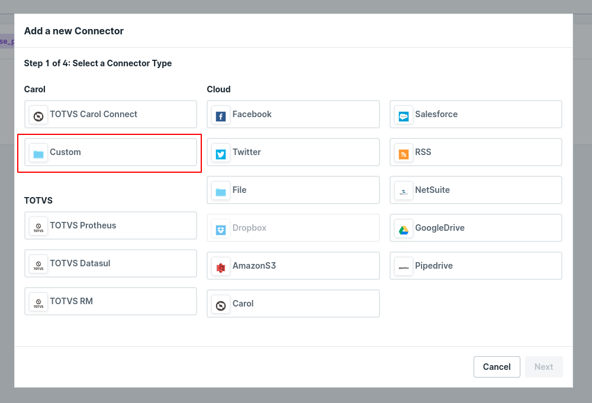
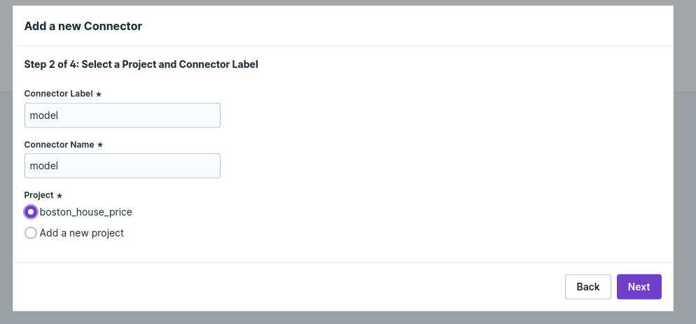
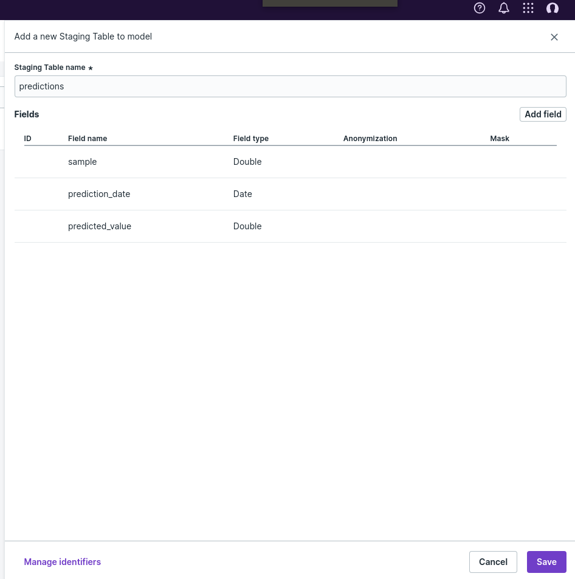
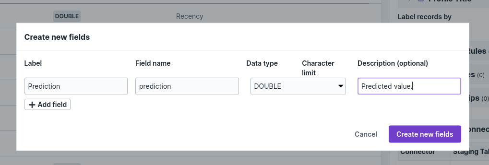
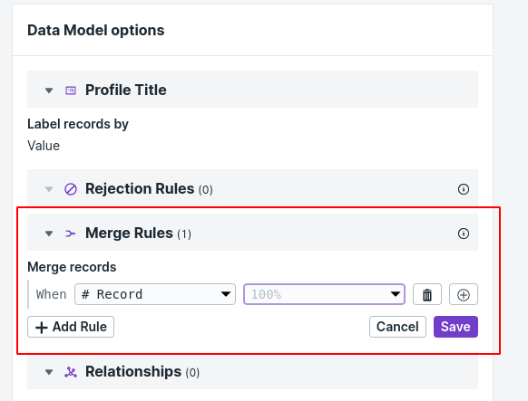
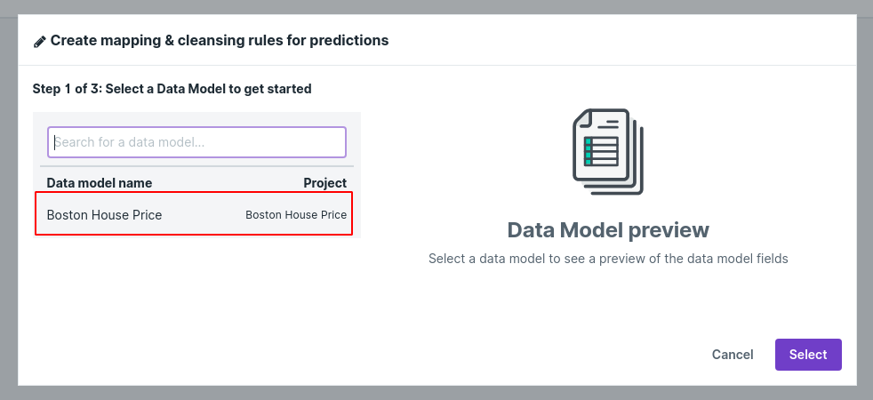
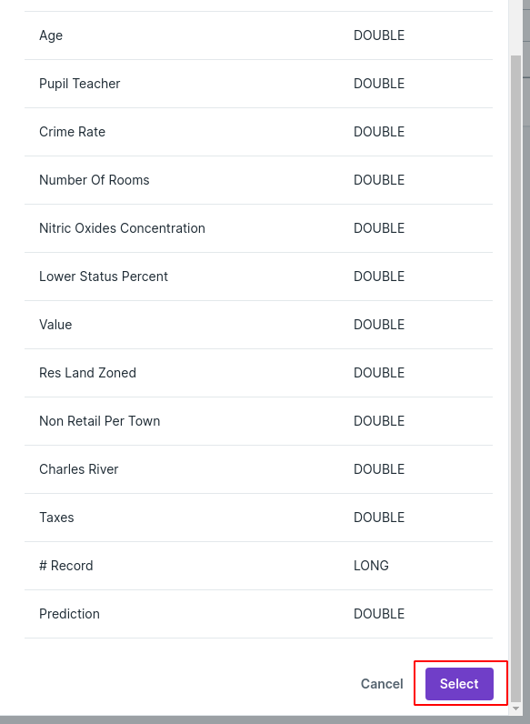
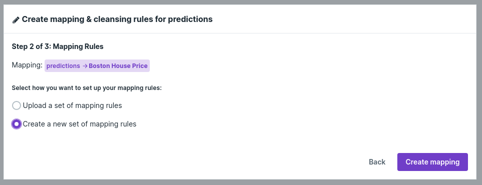
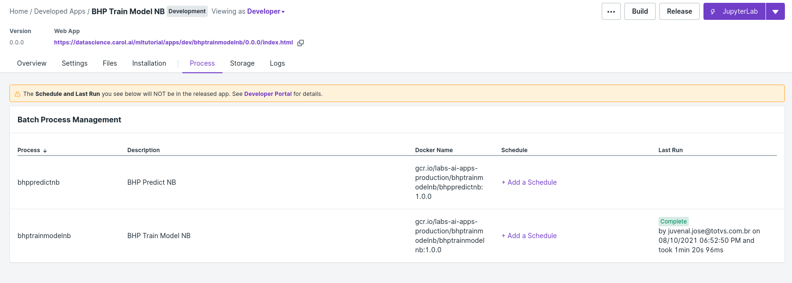
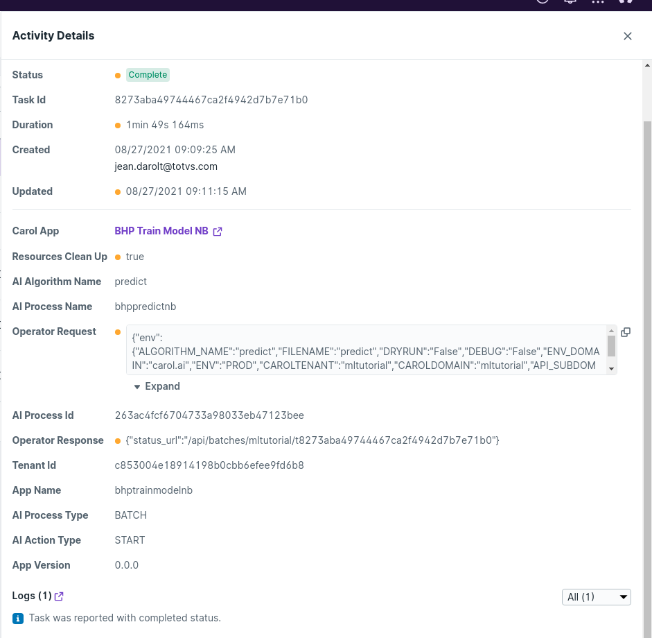

# Predicting

In the previous section we learned how to create a minimal batch app with a single process that trains a regression model. That model was stored in the Carol App storage and can now be used to make predictions. Let's now add another process to that app for that purpose. Notice that a single app may contain as many processes as you need.

## Preparing the Carol environment to store the predictions

Until now, we have had a connector for loading the dataset, with one table. We are going to create a second connector only for inputting predictions. These predictions will later be merged with the dataset into the data model.

### Creating a connector

And let's use "model" as connector name, indicating it will receive data coming from the model:


Select the custom type. It will allow us to add any custom staging tables that we need.






### Creating the staging table

Let's create a staging table to receive all predictions




Remember to add an identifier to the staging table: this is mandatory. After adding the fields, save the changes.


### Adjusting the data model to store the predictions

The predictions sent to the staging need to be merged with the corresponding records. Create a new field called prediction.



Now add the newly created field and add to this data model. Notice that once a field is created you may add it to other models as well.


We also need to create a merge rule in the Boston House Price data model. This will ensure that records with the same primary key that come from different staging tables will be merged into a single record.



Finish by publishing your changes. If you do not publish them, they will not have any impact, but they will be saved as a draft in case you want to finish them later.


### Creating the mapping

Go back to the staging table and let's add a mapping to the Boston House Price data model. Hover over the staging name. The "Map" button should appear. Then choose the target data model.





Check that there is a mapping from the "sample" staging field to the "# Record" model field.


Remember to publish the changes so that the mapping is effective.

## Writing the prediction notebook

Let's create another Jupyter Notebook with the prediction flow. This notebook will be a standalone code (with no dependencies on the previous code), which will allow us to run it on a complete separately Docker container.

The notebook starts by usual imports and getting a Carol object:
```
from pycarol import Carol, Staging, Storage
login = Carol()
```

Then we fetch the data:
```
staging = Staging(login)

conn = "boston_house_price"
stag = "samples"

X_cols = ["CRIM", "ZN", "INDUS", "CHAS", "NOX", "RM", "AGE", "DIS", "RAD", "TAX", "PTRATIO", "B", "LSTAT", "sample"]
roi_cols = X_cols

data = staging.fetch_parquet(staging_name=stag,
                connector_name=conn,
                cds=True,
                columns=roi_cols            
                )
```

We then filter only the test set for prediction:
```
from sklearn.model_selection import train_test_split

_, X_test = train_test_split(data[X_cols], test_size=0.20, random_state=1)
```

The model is loaded from Carol:
```
stg = Storage(login)
mlp_model = stg.load("bhp_mlp_regressor", format='pickle')
```

Then we predict and prepare the Pandas dataframe for sending it to Carol:
```
test_cols = ["CRIM", "ZN", "INDUS", "CHAS", "NOX", "RM", "AGE", "DIS", "RAD", "TAX", "PTRATIO", "B", "LSTAT"]
y_pred = mlp_model.predict(X_test[test_cols])

import pandas as pd
predictions = X_test[["sample"]].copy()
predictions["predicted_value"] = y_pred
predictions["prediction_date"] = pd.Timestamp.now()
```

Finally we send the predictions to our connector:
```
staging = Staging(login)
staging.send_data(
    "predictions",
    data=predictions,
    connector_name="model",
)
```

## Writing the docker file
We will have a second docker image build exclusively for making predictions. In the following section we are going to learn that we can have a single docker image for all processes (if it makes sense to do so).

The Dockerfile is similar to the train one, except for the name of the notebook:
```
CMD ["runipy", "bhp_predict.ipynb"]
```

## Setting the manifest
Now we need to inform the Carol App that we have a new process. That is stored in the manifest.json file.

We need to first create another process in the processes list and then add the docker information:
```
{
    "batch": {
        "processes": [
            {
                "name": "bhptrainmodelnb",
                "algorithmName": "train",
                "namespace": "",
                "algorithmTitle": {
                    "pt-br": "BHP Train Model NB",
                    "en-US": "BHP Train Model NB"
                },
                "algorithmDescription": {
                    "pt-br": "BHP Train Model NB",
                    "en-US": "BHP Train Model NB"
                },
                "instanceProperties": {
                    "profile": "",
                    "properties": {
                        "dockerImage": "bhptrainmodelnb/bhptrainmodelnb:1.0.0",
                        "instanceType": "c1.small"
                    },
                    "environments": {}
                }
            },
            {
                "name": "bhppredictnb",
                "algorithmName": "predict",
                "namespace": "",
                "algorithmTitle": {
                    "pt-br": "BHP Predict NB",
                    "en-US": "BHP Predict NB"
                },
                "algorithmDescription": {
                    "pt-br": "BHP Predict NB",
                    "en-US": "BHP Predict NB"
                },
                "instanceProperties": {
                    "profile": "",
                    "properties": {
                        "dockerImage": "bhptrainmodelnb/bhppredictnb:1.0.0",
                        "instanceType": "c1.small"
                    },
                    "environments": {}
                }
            }
        ]
    },
    "docker": [
        {
            "dockerName": "bhptrainmodelnb",
            "dockerTag": "1.0.0",
            "gitBranch": "master",
            "gitPath": "/",
            "instanceType": "c1.small",
            "gitDockerfileName": "Dockerfile",
            "gitRepoUrl": "https://github.com/JuvenalDuarte/bostonhouseprice_jupyter_batchapp"
        },
        {
            "dockerName": "bhptestnb",
            "dockerTag": "1.0.0",
            "gitBranch": "master",
            "gitPath": "/",
            "instanceType": "c1.small",
            "gitDockerfileName": "Dockerfile",
            "gitRepoUrl": "https://github.com/JuvenalDuarte/bostonhouseprice_jupyter_batchapp"
        }
    ]
}
```

Check that the predict process is listed in the App:



## Building the image

For building the image, repeat the same steps performed in the "Training the model" section. Remember that you first need to update the manifest.json file on the Carol App files, then build the correct image.

## Running the prediction

Running the process is simple, just click the run button.


You may see the running process in the activities:



You can check that the staging table has received all predictions:


Then you can check if the data model has also received the predictions and that they are already merged. Please note that it may take a while to the merge to happen, so in the meanwhile you may see the old record plus a pending merge record with your new changes.


## Troubleshooting
