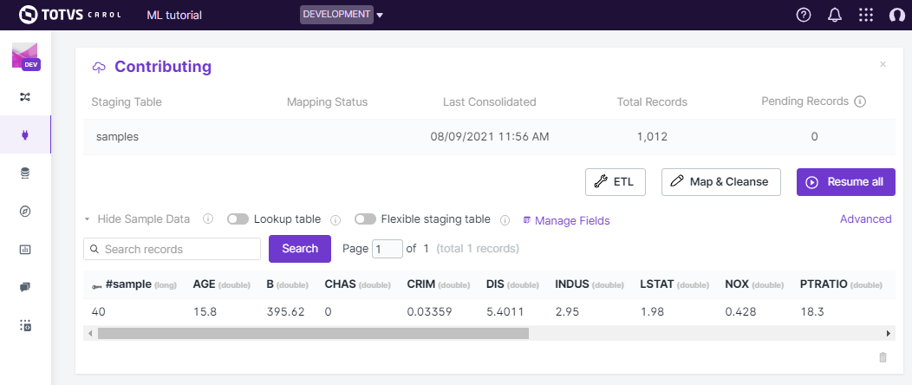

# Copying data to Carol

As mentioned on the introduction, there are several ways to copy data from external applications to the Carol platform, for this tutorial we will make use of an external tool: the **PyCarol** python package. The library can be installed through the pip command below (see [https://pycarol.readthedocs.io/en/2.31.2/pycarol/pyCarol.html](https://pycarol.readthedocs.io/en/2.31.2/pycarol/pyCarol.html) for an extensive documentation).

```python
pip install pycarol
```

## Loading your data

PyCarol makes it easier to connect, authenticate and flow data throught Carol environments. On this example we will load the famous academic dataset **Boston House Prices**, organize the samples on a dataframe and then load it to staging into Carol.

```python
import pandas as pd
import numpy as np
from sklearn.datasets import load_boston

# Loading the dataset from Scikit Learn
boston_dataset = load_boston()

# Composing the column names
column_names = list(boston_dataset['feature_names']) + ['target']

# Creating a dataframe
boston_dataframe = pd.DataFrame(data= np.c_[boston_dataset['data'], boston_dataset['target']],
columns=column_names)

# Using the row number as a primary key
boston_dataframe["sample"] = boston_dataframe.index
```

## Sending it to carol

We start by defining a connection to the carol platform. To make the connection, though, we need to setup the security authorization to the environment, which is made through the access **Token**. We've created this security token on the previous chapter, if you are not familiar with it, please, check the Introduction page.

```python
from pycarol import Carol, Staging, ApiKeyAuth

# =================== AUTHENTICATION ON CAROL ===================
# Paste here your connection id and token
connectors = {"mltutorial": '0f0883dXX2434057XXXf07ef86eXXXXX'}
conn_tokens = {"mltutorial": '906XXb5ae5e7413c97fXXXX7d0XXXXXX'}
# ===============================================================

login = Carol(domain="mltutorial", 
							app_name="bostonhouseprice", 
							organization='datascience',
							auth=ApiKeyAuth(conn_tokens["mltutorial"]),
							connector_id=connectors["mltutorial"])

''' Simplified version for when running it inside an carol app
login = Carol(domain="mltutorial",
app_name="bostonhouseprices",
organization='datascience')
'''
```

On this example we are simply passing the credentials directly through the code, which is not the best approach for long term solution, specially if this code needs to go through version control servers. A better solution is to store these credentials in expernal files, preferably encrypted, and load them at run time.

> **Note**: When running similar code inside a Carol App the authentication may be omitted, since it can be infereed through the user running the app. The simplified code for apps would be as the commented code below. Even domain, app_name and organization parameters can be supressed when running inside apps, in that case they will be retrieved from the environment the app is running on.

If everything went well on your data ingestion, now you should be able to see your staging on the user interface by clicking on `connectors` on the left panel, selecting your connector. You can view sample records by clicking on `View sample data` (figure 11).



Figure 11: Checking sample records on the Carol platform.

You can find the full notebook used in this exercise on <put the link to git>.

> **Note**: The same approach can be use to load any tabular data into Carol, just make sure you have your dataset stored on a dataframe and use PyCarol to help on the loading process.

## Troubleshooting

A couple of well known problems when loading data to Carol are given below:

- **Bad crosswalk**: It happens when the columns provided as the crosswalk parameter doesn't holds the unique property for the records.

- **Inconsistent schema**: If the staging has been already created before with columns and data types it may result in conflicts when loading new data. In that case it is recomended, whenever it is possible, to drop the previous staging and reload the full data.

[Go back to main page](../../)

[Go to next chapter](../ch3_datamodel/)