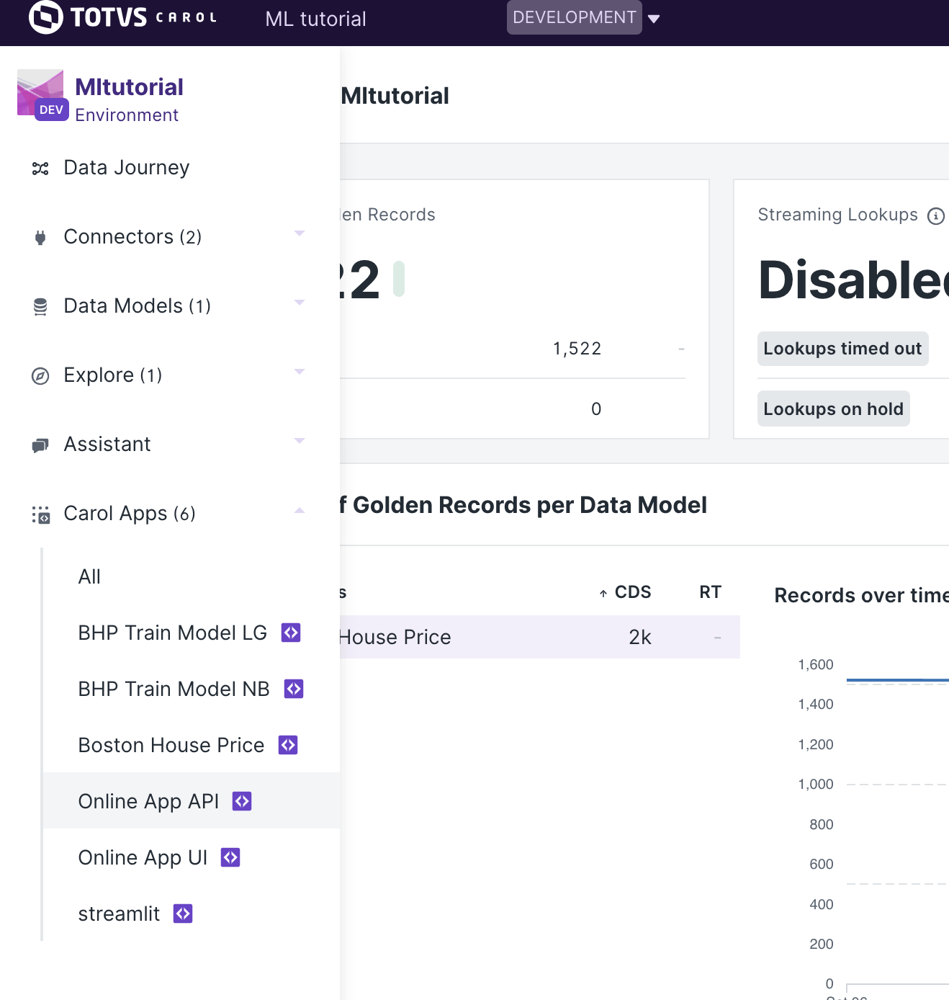
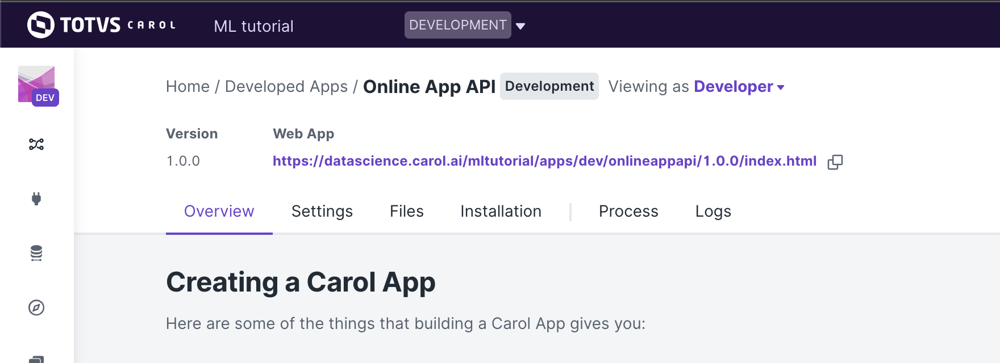
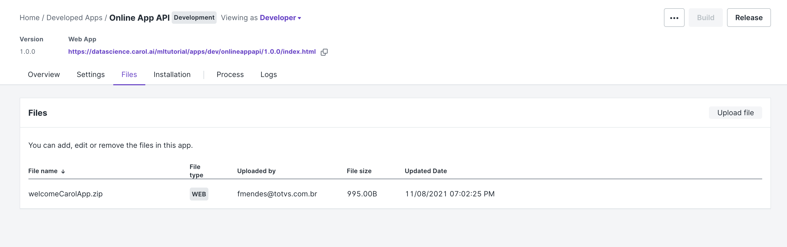
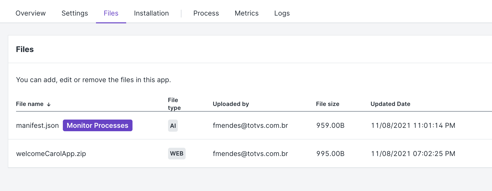
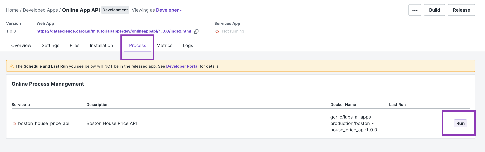

# Carol environment: how to get started

If you need to know more about the process of creating Apps on Carol please refer to []().

# Online app

An online app is a server that runs on top of Carol. In this tutorial we will be covering the creation of an online app api.

Our online app is created using the [Flask](https://flask.palletsprojects.com/en/2.0.x/) and [Marshmallow](https://marshmallow.readthedocs.io/en/stable/quickstart.html#) frameworks and it runs using a [gunicorn server](https://gunicorn.org/).

On this example we present a simple online app api that loads the Boston House Prices model trained in the [batch app tutorial]().

Our endpoints allow us to predict a house price sending in the request some information about the house in question as well as allows us to reload the model loaded in the memory in case it has been retrained.

# Online app api structure

An online app usually have the follow structure:

```
app/
    __init__.py
    functions.py
    routes.py
Dockerfile
manifest.json
requirements.txt
gunicorn.conf.py
main.py
```

The `main.py` will be the Docker image entrypoint, it is where we create the app and enable the CORS policy so we can make cross-origin AJAX possible.

The `app/` folder is where we place our code. In `functions.py` we organize all the classes and methods that we want to use in our api. While in the `routes.py` we write the endpoints (routes) as well as their possible validations.

The necessary packages to our api are saved in a `requirements.txt` file and they will be installed when the Dockerfile is run on the docker build process.

In our case we have these packages in `requirements.txt`:
```
pandas==1.2.5
flask
flask-cors
flask-login
flask-wtf
gunicorn
pycarol[dataframe]>=2.40.1
webargs
sklearn
```

With the exception of the sklearn package all the other packages must be used when you are creating an online app.

The `gunicorn.conf.py` is where we set the [configurations](https://docs.gunicorn.org/en/stable/settings.html#settings) (for instance, number of worker processes, the socket to bind, etc.) for the gunicorn server.

`Dockerfile`:
Our Dockerfile simply copy the files from our repository to a container and install the packages that we have added to `requirements.txt`. Finally, we expose the port 5000 which is the default port for online apps in Carol and we start the gunicorn server.

```
FROM python:3.8

RUN mkdir /app
WORKDIR /app
ADD requirements.txt /app/
RUN pip install -r requirements.txt

ADD . /app

EXPOSE 5000

CMD gunicorn -c /app/gunicorn.conf.py main:application
```


This forementioned structure covers much of the cases that you may need. Therefore, we usually only add endpoints to `route.py`, classes and methods to `functions.py` and packages to `requirements.txt`. Keeping the `Dockerfile`, `gunicorn.conf.py`, and `main.py` as they are.

## Setting up a dev environment

When Carol runs a process, it injects into the Docker container some environment variables that will be read when we call:
```
login = Carol()
```

When running our app locally we have to inject these variables ourselves.

For that, we create an .env file with the following content:

```
# datascience.carol.ai/mltutorial
CAROLAPPNAME=bhponlineapp
CAROLAPPOAUTH=<put your token here>
CAROLCONNECTORID=d69c6f0ea6334838a75a38b543c0214b
CAROLORGANIZATION=datascience
CAROLTENANT=mltutorial
ALGORITHM_NAME=bhponlineapp
```

CAROLAPPNAME: the name of the app created in Carol. To see how you can create an app in Carol please refer to [Creating a Carol App]().

CAROLAPPOAUTH: the api key (access token) created in Carol. To see how you can create an api key please refer to [Generating an access token](https://tdn.totvs.com/pages/releaseview.action?pageId=552107176#id-2.Autentica%C3%A7%C3%A3o-ConnectorToken(APIKey)).

CAROLCONNECTORID: the connector id attached to the api key added in CAROLAPPOAUTH.

CAROLORGANIZATION: the name of the organization in which your app has been created.

CAROLTENANT: the name of the environment in which your app has been created.


## Running our app locally

Carol runs its apps inside Docker containers for that we need to have built images created from our app code.

When we want to run our app locally and simulate what Carol does in the real scenario we use the following docker commands:

### Building the docker image:

It creates a docker image using the recipe we have created in our Dockerfile.

We build an image by running:

```
docker build -t <docker name> .
```

In `<docker name>` you can add any name that relates to your app.

In the real scenario this process happens when we Build a Carol app.

### Building the docker image:

It runs the docker image created in the previous step.

We run an image by running:

```
docker run --rm -it -p 5000:5000 --env-file .env <docker name>
```

In `<docker name>` you need to call the same name defined in the build process.

Here we use the `.env` file that simulates the injection of enviroment variables.

In the real scenario this process happens when we Run a process in a Carol app.

## Deploying our app in Carol

To deploy our app in Carol we first need to create a `manifest.json` file

The `manifest.json` for an online app follows the structure:

```
{
  "online": {
    "processes": [
      {
        "name": "boston_house_price_api",
        "algorithmName": "main",
        "namespace": "",
        "algorithmTitle": {
          "pt-br": "Boston House Price API",
          "en-US": "Boston House Price API"
        },
        "algorithmDescription": {
          "pt-br": "Boston House Price API",
          "en-US": "Boston House Price API"
        },
        "instanceProperties": {
          "profile": "",
          "properties": {
            "dockerImage": "boston_house_price_api:1.0.0",
            "instanceType": "c1.small"
          }
        }
      }
    ]
  },
  "docker": [
    {
      "dockerName": "boston_house_price_api",
      "dockerTag": "1.0.0",
      "gitBranch": "tutorial-mendes",
      "gitPath": "/tutorial/Online%20app%20api/",
      "instanceType": "c1.small",
      "gitDockerfileName": "Dockerfile", 
      "gitRepoUrl": "https://github.com/totvslabs/pyCarol.git"
    }
  ]
}
```

To understand which of the manifest's fields please refer to [Manifest file](https://docs.carol.ai/docs/manifest-file)

Once we have the `manifest.json` ready we need to upload it in our Carol App.

Firstly, we go to our Carol App page.



Always make sure that you are in the Developer view.



In the `Files` section we click on `Upload File` and we choose the `manifest.json` file that we have just created.



Once the file is uploaded, its name will be presented in the Files.



Now, we can [Build our app](https://docs.carol.ai/docs/building-docker-image-on-carol#carol-app-flow-github).

Then, when the build process is complete we can start our app by clicking on `Run` in the `Process` section.



The app will remain running until it is stopped by clicking on the `Stop` button.

## Testing our API:

Since we added a `@requires_auth` decorator in our endpoints we will need to send some kind of authentication information in our request so our api can authenticate us with Carol.

For a better understanding on how to authenticate with Carol please refer to [Authentication](https://tdn.totvs.com/pages/releaseview.action?pageId=552107176)

Using the record below as the input let's see three different ways of sending a request to our api:

```
sample = {'age': 82.0,
 'b': 232.6,
 'chas': 0.0,
 'crim': 1.38799,
 'dis': 3.99,
 'indus': 8.14,
 'lstat': 27.71,
 'nox': 0.538,
 'ptratio': 21.0,
 'rad': 4.0,
 'rm': 5.95,
 'tax': 307.0,
 'zn': 0.0}
```

If your testing your api locally then your URL will be:

```
url = http://localhost:5000/house_price'
```

If your api has already been deployed to Carol and you want to test it, then your URL will be the URL presented in the `Services App` (see Figure below).

For instance:

```
url = https://mltutorial-onlineappapi.apps.carol.ai/house_price'
```

### 1. Using a Bearer token

```
headers={'Authorization': <BEARER TOKEN>}

r = requests.post(url, json=sample, headers=headers)
```

### 2. Using user and password

```
user = <EMAIL IN CAROL>
password = <PASSWORD TO LOG IN TO CAROL>
r = requests.post(url, json=sample, auth=(user, password))
```

### 2. Using an api key (connector token)

```
headers={'X-Auth-Key': <API KEY>, 'X-Auth-ConnectorId': <CONNECTOR ID ATTACHED TO THE API KEY>}
r = requests.post(url, json=sample, headers=headers)
```